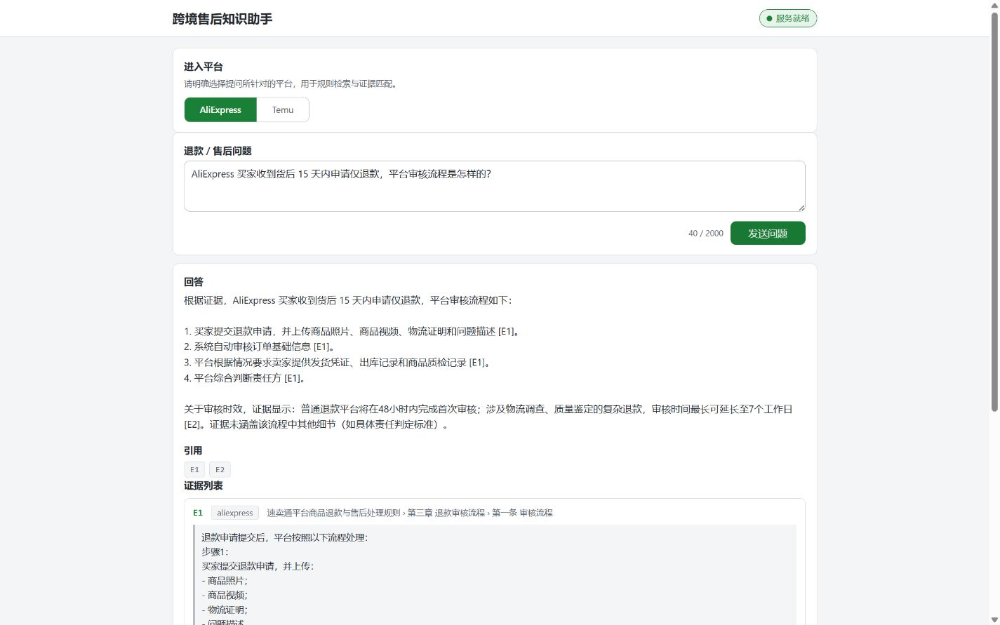
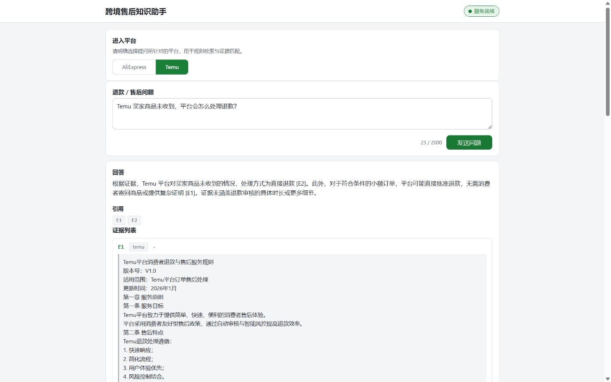

# Customer Service RAG

面向 AliExpress / Temu 跨境电商的**退款售后规则问答 RAG**：离线用 Docling 把平台规则
DOCX 解析、切块并入库本地 Qdrant；在线通过 FastAPI 提供「平台门控 → DeepSeek 意图分类
→ BGE 检索重排 → Evidence Gate」层层拦截后，由 DeepSeek 生成带 `[E1]` 引用的回答。

**当前范围仅限退款与售后**（refund_after_sales）类咨询：与该范围无关或意图不确定的
问题会被拦截并返回固定话术，不提供通用客服问答。

## 架构（简版）

```text
data/*.docx
    │  离线入库链（Docling 解析 → 切块 → 合并 → 向量化 → 索引，一次性执行）
    ▼
output/qdrant_storage + output/embedding_manifest.json
    ▲                                    │
    │                                    ▼
浏览器 ──▶ FastAPI ──▶ 平台门控 → 意图分类 → 检索重排 → Evidence Gate
                                                │
                                                ▼
                                    DeepSeek 生成带 [E1] 引用的回答
```

业务 blocked 状态返回 HTTP 200（fail closed），不做通用兜底回答。

## 界面演示

同一界面支持显式选择 AliExpress / Temu 平台，回答展示引用编号及对应证据内容，
便于核对生成结果与知识库来源。

**AliExpress：签收后退款审核流程**



**Temu：商品未收到退款处理**



## HTTP 接口

| 方法 | 路径 | 作用 |
|---|---|---|
| GET | `/` | 本地 Web 演示界面（原生 HTML/CSS/JS） |
| GET | `/health` | 存活检查（Liveness） |
| GET | `/ready` | 就绪检查：本地静态校验 API Key / embedding manifest / Qdrant collection / 维度匹配 |
| POST | `/v1/answer` | 问答接口：请求体校验失败 422；业务 blocked 一律 HTTP 200 并以 `status` 字段表达；上游结果无效 502（invalid_upstream_response）、服务不可用 503（service_unavailable） |

## 环境准备（Windows PowerShell）

需要 Python 3.10+，在项目根执行：

```powershell
py -3.10 -m venv .venv
.\.venv\Scripts\python.exe -m pip install -e .
```

- 依赖版本直接固化在 `pyproject.toml`（无依赖锁文件），安装需联网下载 torch 等大包；
- 知识库产物 `output/`（Qdrant 存储与 embedding manifest）必须已存在：从既有环境复制，
  或按 [docs/MAIN_FLOW.md](docs/MAIN_FLOW.md) 的离线入库链重建（重建需要 `data/*.docx`
  原始文档，并联网下载 BGE 模型）。

## 设置 API Key（重要）

- 程序**只从环境变量** `DEEPSEEK_API_KEY` 读取密钥，**不会自动加载**根目录的
  `deepseek_api.env`（该文件只是人工保存密钥的地方，需要自行设置到环境变量）；
- 变量清单见 [.env.example](.env.example)：复制为 `.env`（已被 git 忽略）填入真实值。
  两种方式二选一：
  - **用启动脚本**（推荐）：`scripts/start_web.ps1` 会自动加载 `.env` 中的白名单变量，
    无需手动设置；已在当前进程中设置的同名环境变量**优先于** `.env`，不会被覆盖；
  - **直接运行 Uvicorn**：脚本不参与，必须在**启动 Uvicorn 的同一终端**手动设置——
    `$env:` 仅对当前终端会话生效，换终端要重新设置：

```powershell
$env:DEEPSEEK_API_KEY = "sk-你的密钥"
```

## 启动与访问

### 方式一：启动脚本（推荐）

```powershell
.\scripts\start_web.ps1                 # 读取根目录 .env，检查通过后前台启动
.\scripts\start_web.ps1 -CheckOnly     # 只做检查不启动（全部通过退出码 0）
.\scripts\start_web.ps1 -Port 8080 -BindHost 0.0.0.0 -EnvFile .\other.env
```

脚本行为：默认加载项目根 `.env`（仅白名单变量，纯文本解析，不执行任何脚本内容；
`DEEPSEEK_API_KEY` 只报告是否已设置、绝不打印），依次检查 `.venv` Python、
`output/embedding_manifest.json`、`output/qdrant_storage/meta.json`（collection 与
维度匹配）与 API Key，全部通过后**自动切到项目根**前台启动 Uvicorn（Ctrl+C 停止）。

### 方式二：直接运行 Uvicorn

仍在项目根、设置好 Key 的同一终端执行（readiness 与检索按相对路径定位
`output/`，换目录启动会找不到知识库）：

```powershell
.\.venv\Scripts\python.exe -m uvicorn customer_service_rag.api:app
```

浏览器打开 <http://127.0.0.1:8000/> 使用演示界面；也可以直接调用接口：

```powershell
$body = @{ query = "退款多久到账？"; entry_platform = "aliexpress" } | ConvertTo-Json
Invoke-RestMethod -Uri http://127.0.0.1:8000/v1/answer -Method Post -ContentType "application/json" -Body $body
```

## 测试

```powershell
.\.venv\Scripts\python.exe -m unittest discover -s tests -v
# 基线：193 passed / 0 failed / 2 skipped
```

默认配置不真实调用 DeepSeek、不加载真实 Embedding / Reranker（外部依赖以依赖注入或
Mock 替换）；online / heavy 验收默认跳过（即基线中的 2 skipped）：设置
`RAG_P0_ONLINE=1` 且环境已有 `DEEPSEEK_API_KEY` 才真实调用 DeepSeek；设置
`RAG_P0_HEAVY=1` 才加载真实 Embedding / Reranker 与 Embedded Qdrant（本地检索栈，
非在线外部调用）。

## 文档

- [docs/MAIN_FLOW.md](docs/MAIN_FLOW.md)：主流程地图——完整架构、接口契约、
  证据包状态机与限制细节。
- [docs/TEST_REPORT.md](docs/TEST_REPORT.md)：本轮已确认的演示与测试事实。


## Roadmap（仅计划，均未实现）

- 侵权检测：当前系统不具备该能力，仅为后续规划方向；
- 引用语义校验、Evidence Gate 阈值标定、索引增量更新。
